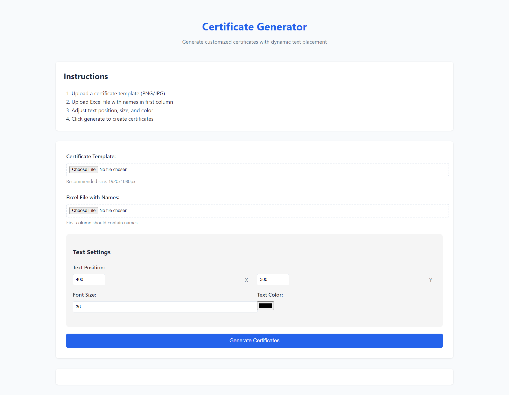
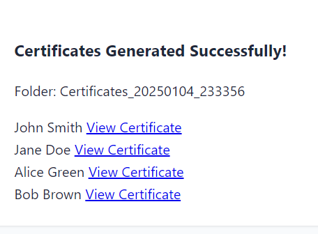
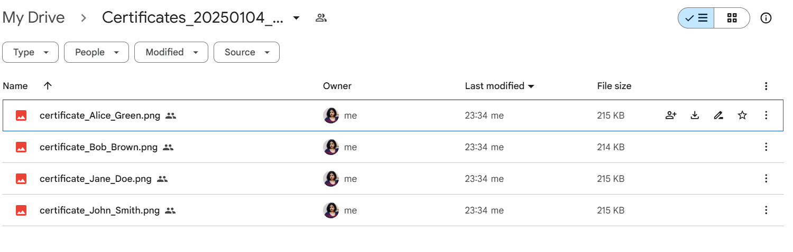
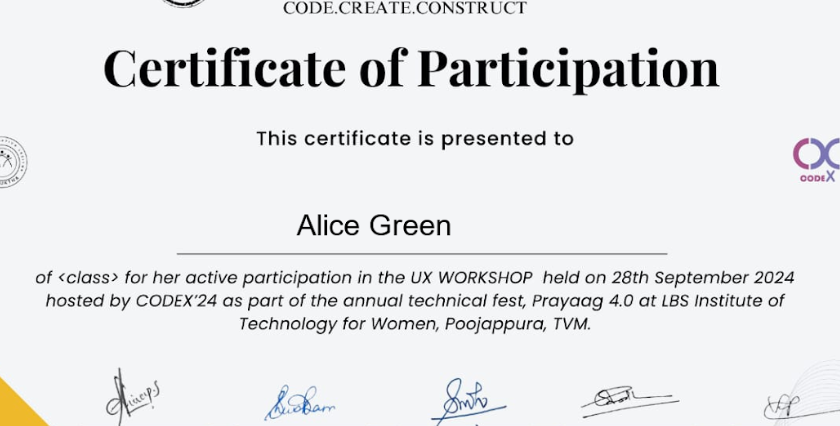

# Laureate.io - Certificate Generator

[](https://www.python.org/downloads/)
[](https://flask.palletsprojects.com/)

A  Flask-based web application that automatically generates customized certificates from a template and Excel data, with Google Drive integration for cloud storage.

### Quick Demo
[Watch Local Demo](screenshots/recording.mp4)

## 📸 Application Screenshots

### Homepage & Main Interface

*Main dashboard for template and data upload*

### Step-by-Step Process
| Certificate Generated | Google Drive |
|----------------------|-----------------|
| | |

### Generated Results


## 📺 Video 

[](https://www.youtube.com/watch?v=F_E-y25bC-o)

##  Features

### Core Functionality
- Web-based interface for easy certificate generation
- Bulk processing from Excel files (.xlsx, .xls)
- Dynamic text positioning with live preview
- Customizable font size and color
- Google Drive integration for cloud storage

### File Support
- Templates: PNG, JPG, JPEG
- Data: XLSX, XLS
- Maximum file size: 16MB

### Storage Options
- Local storage backup
- Google Drive integration
- Easy sharing capabilities

##  Installation

### Prerequisites
- Python 3.8 or higher
- pip (Python package manager)
- Google Cloud Platform account (for Drive integration)

### Setup Steps

1. **Clone Repository**
```bash
git clone https://github.com/yourusername/certificate-generator.git
cd certificate-generator
```

2. **Create Virtual Environment**
```bash
python -m venv venv
source venv/bin/activate  # On Windows: venv\Scripts\activate
```

3. **Install Dependencies**
```bash
pip install -r requirements.txt
```

4. **Google Drive Setup**
- Create project in Google Cloud Console
- Enable Google Drive API
- Download credentials as `credentials.json`
- Place in project root directory

##  Usage Guide

1. **Start Application**
```bash
python app.py
```

2. **Access Interface**
- Open browser to `http://localhost:5000`
- See homepage screenshot for reference

3. **Upload Files**
- Select certificate template
- Upload Excel file with names
- Follow template setup shown in screenshots

4. **Configure Settings**
- Set text position (X/Y coordinates)
- Adjust font size and color
- Use live preview for guidance

5. **Generate Certificates**
- Click "Generate Certificates"
- View results in output panel
- Download or access via Google Drive


##  Technical Details

### Required Dependencies
```python
flask==2.0.1
pillow==8.3.1
pandas==1.3.0
werkzeug==2.0.1
flask-cors==3.0.10
google-api-python-client==2.15.0
google-auth-httplib2==0.1.0
google-auth-oauthlib==0.4.4
```

### Configuration Options
```python
# app.py
MAX_CONTENT_LENGTH = 16 * 1024 * 1024  # 16MB max-size
ALLOWED_EXTENSIONS = {'png', 'jpg', 'jpeg', 'xlsx', 'xls'}
```

##  Security Features

- Secure filename handling
- File type validation
- Size restrictions
- CORS enabled
- OAuth 2.0 authentication

### Common Issue & Solutions

1. **Google Drive Auth Issues**
- Check credentials.json setup
- Verify OAuth scope
- Confirm API enablement
